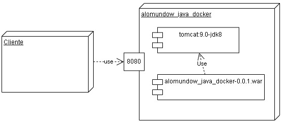

# Alomundo Java WEB com Docker

Aplicação **Alomundo WEB** desenvolvida em **Java** e executada em um container Docker.

## Sobre o projeto

 - O projeto foi desenvolvido utilizando o **NetBeans**.
 - O nome do projeto deve ser **alomundow_java_docker**.
 - Utiliza o **Java 8**.
 - Utiliza o **Apache Tomcat 9** como servidor de aplicações Web.
 - Utiliza o **Apache Maven** para automatizar o processo de construção da aplicação.
 - A aplicação é empacotada no formato **WAR (Web Application Archive)**.
 - Utiliza o **Docker** para criar uma imagem e executar a aplicação em um container.

## Comandos Docker
 - Utilizar o terminal do Windows Powershel em modo administrador.

### Construir a aplicação
 - ```docker build -t alomundow_java_docker .```

### Rodar a aplicação
 - ```docker run --rm -p 8080:8080 alomundow_java_docker```

### Abra o navegador em:
 - http://localhost:8080/
 ou
- http://localhost:8080/?nome=Java
 ou
 - http://localhost:8080/servlet/AloMundo
 ou
- http://localhost:8080/servlet/AloMundo?nome=Java

### Remover imagem
 - ```docker rmi alomundow_java_docker```

## Arquitetura do Sistema



## Docker Hub
 - https://hub.docker.com/r/osmarbraz/alomundo_java_docker